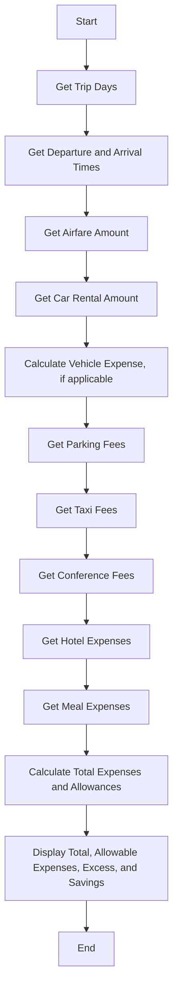

# Chapter 6 Team Challenge: Travel Expenses  
Cole, Jadon, and Jullian  

## Chapter 6 Team Challenge: Travel Expenses Description  
This program calculates and displays the total travel expenses for a businessperson on a trip. It allows input for various expenses like airfare, car rentals, and hotel stays, and enforces company allowances for categories like parking, taxi, and meal expenses. The program calculates any excess costs the businessperson must pay and any savings they achieved by staying under allowances. The main function orchestrates input and output by calling other functions dedicated to each expense type.

### Chapter 6 Team Challenge: Travel Expenses Flowchart  

#### Function Diagrams

| `get_trip_days`    |               |  Jadon       |
| ------------------ | ------------- | ------------ |
| `days:int`         | takes input for the number of days on the trip | returns days as integer |
***
| `get_trip_times`   |               |  Jullian      |
| ------------------ | ------------- | ------------ |
| `departure:int`   | takes input for departure time on the first day  | returns time in 24-hour format |
| `arrival:int`     | takes input for arrival time on the last day  | returns time in 24-hour format |
***
| `get_expenses`     |               |  Cole    |
| ------------------ | ------------- | ------------ |
| `airfare:double`    | takes input for airfare amount  | returns airfare amount |
| `car_rental:double` | takes input for car rental amount | returns car rental amount |
| `miles:int`        | takes input for miles driven (if private vehicle used) | returns total vehicle expense at $0.27/mile |
***
| `get_fees`         |               |  Cole       |
| ------------------ | ------------- | ------------ |
| `parking:double`    | takes input for daily parking fees | returns total parking costs exceeding $6/day |
| `taxi:double`       | takes input for daily taxi fees | returns total taxi costs exceeding $10/day |
***
| `get_lodging`      |               |  Jadon      |
| ------------------ | ------------- | ------------ |
| `hotel:double`      | takes input for hotel expenses | returns total lodging costs exceeding $90/night |
***
| `get_meal_costs`   |               |  Jadon    |
| ------------------ | ------------- | ------------ |
| `meals:dict`       | takes input for each allowable meal cost based on departure and arrival times | returns total meal expenses exceeding allowance |
***
| `calculate_total`  |               |  Jadon       |
| ------------------ | ------------- | ------------ |
| `expenses:double`   | calculates total expenses and total allowable | returns excess cost and savings
