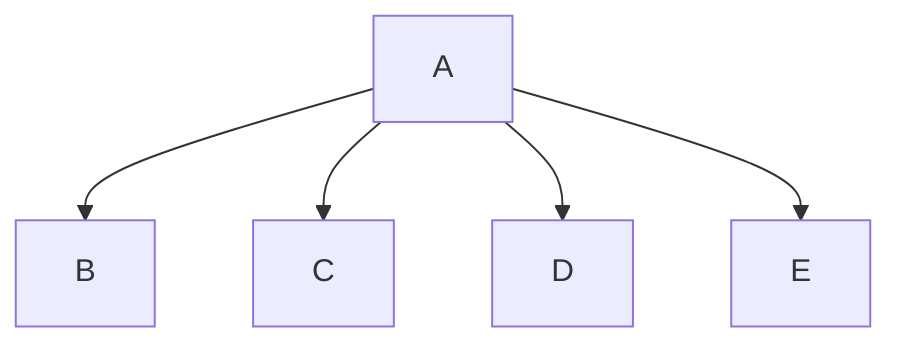

# Chapter 6 Team Challenge: Travel Expenses
Cole, Jadon, and Jullian

## Chapter 6 Team Challenge: Travel Expenses Description
Here is where you describe what the program does

### Chapter 6 Team Challenge: Travel Expenses Flowchart

#### Function Diagrams

| `function name1`    |               |  author     |
| ------------------ | ------------- | ------------ |
| `argument:type`    | takes input from the user for ____  |              |
| `time:integer`     | calculates ______  | outputs ____             |
| `name:string`      | takes input for name ___ | returns total |
***
| `function name2`    |               |     author   |
| ------------------ | ------------- | ------------ |
| `argument:type`    | takes input from the user for ____  |              |
| `time:integer`     | calculates ______  | outputs ____             |
| `name:string`      | takes input for name ___ | returns total |
***
